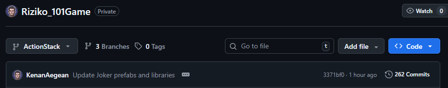
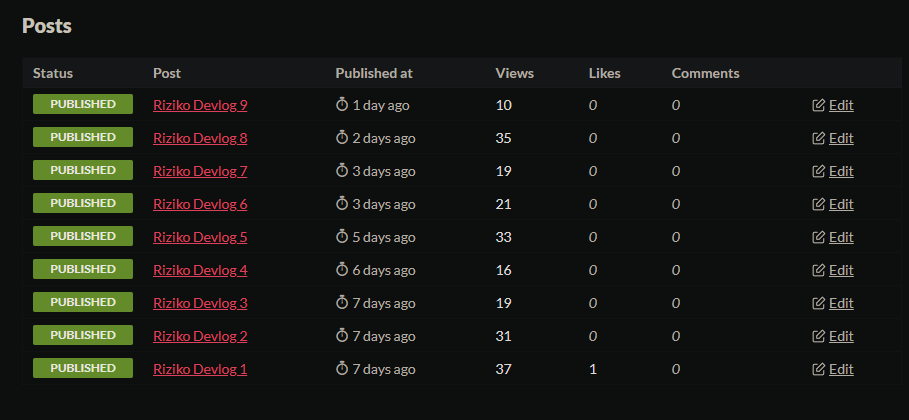
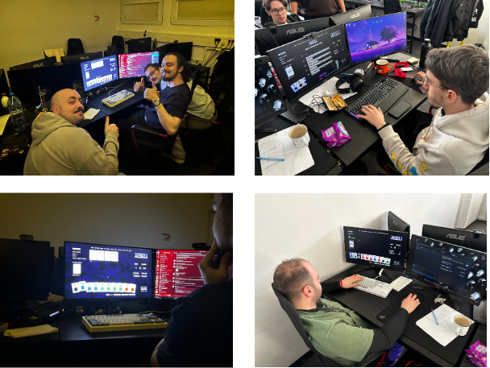

# RIZIKO

<p align="center">
  <br>
</p>

**Play it on Itch:** [kenanege.itch.io/riziko](https://kenanege.itch.io/riziko)

Riziko is a roguelike deck-builder built on top of Turkish Rummy (*Okey 101*) tile-melding rules. You build a hand of Jokers that modify and multiply your score, and try to outlast a boss before they outscore you.

---

## Table of Contents

- [Why I Picked This Project](#why-i-picked-this-project)
- [Core Gameplay Loop](#core-gameplay-loop)
- [Architecture Overview](#architecture-overview)
- [Key Systems](#key-systems)
  - [Tile System](#tile-system)
  - [Hand Solver](#hand-solver)
  - [Joker Engine](#joker-engine)
  - [Shop System](#shop-system)
  - [Boss AI](#boss-ai)
  - [Seed System](#seed-system)
  - [PlayFab Backend](#playfab-backend)
  - [Localization and Data-Driven UI](#localization-and-data-driven-ui)
  - [BigInteger Scoring](#biginteger-scoring)
- [The Biggest Bug](#the-biggest-bug)
- [Development Process](#development-process)
- [Playtesting](#playtesting)
- [What's Next](#whats-next)
- [Tech Stack](#tech-stack)

---

## Why I Picked This Project

I chose this concept because I am a huge fan of roguelike deck-builders (like *Balatro*, a poker-based card game where you stack Jokers until your score reaches absurd numbers, and *Incryption*) and traditional Turkish tile games (like *Okey 101*). I wanted to challenge myself to merge these two completely different genres. Building a complex turn-based game was also the perfect place to heavily use and test the ActionStack architecture required by the assignment.

---

## Core Gameplay Loop

A run is split into three levels:

- **Run** - the full session, covering all shop visits and boss fights
- **Round** - a combat phase where you need to hit a score threshold before the boss does
- **Hand** - a single tile play or discard, where Joker effects trigger and score is calculated

After each round you visit the shop to pick up new Jokers before the next boss.

---

## Architecture Overview

All turn logic runs through a custom **ActionStackManager**, which is basically a command queue. Instead of coroutines, each step in the turn is its own action object that gets pushed to the stack and executed in order.

| Action | Role |
|---|---|
| `GameSessionAction` | Manages the full player-side run loop |
| `BossSessionAction` | Drives the boss's turn logic and reactions |
| `DiscardTilesAction` | Handles tile discard resolution safely |
| `UnifiedPlayTilesAction` | Resolves tile plays, scoring, and Joker triggers |
| `PlayerTurnAction` | Coordinates a single player turn end-to-end |

This means chain reactions (a Joker changing a score that then triggers a boss ability) always resolve in a predictable order with no race conditions.

---

## Key Systems

### Tile System
`TileManager` handles the full deck lifecycle: shuffling, dealing, and tracking tile state. Each `Tile` stores its value, colour, and current state. `TileVisual` handles rendering and animation. `TileScriptable` assets define tile types in the editor so tile data stays out of code.

### Hand Solver 
(`RizikoRules`)
A pure C# class with no Unity dependencies that validates and scores tile plays. It uses **recursive backtracking** to find the mathematically best hand every time, so you never get a suboptimal result from a greedy approach. It recognises sets, runs, pairs, and also detects "sloppy play" for score penalties.

### Joker Engine
Jokers are the main scoring driver. Each Joker is a `JokerDefinition` (data) paired with a `JokerEffect` (behaviour) that plugs into the scoring pipeline. The right combination of Jokers creates multipliers that compound fast. `JokerManager` tracks active Jokers during a run, `JokerLibrary` defines the full pool, and all effect logic lives in `JokerEffects.cs`.

### Shop System
`ShopSceneController` handles everything between rounds: generating the item pool from the seeded RNG, processing purchases with the in-game *Riziko* currency, and sending the player to the next round or boss. `ShopItemUI` drives each item card with hover feedback and live affordability checks.

### Boss AI
`BossAI` makes bosses active opponents rather than just score targets. Each boss reads the game state and applies modifiers to disrupt your strategy. `BossConfig` defines per-boss behaviour and `BossHandManager` handles the boss's tile draws and plays.

### Seed System
The seed controls the entire run deterministically: shop inventory, Joker pool, tile draws. Players enter or share seeds via `SeedEntryPanel` and `SeedDisplayUI`, which makes it easy to compete on identical runs or reproduce bugs.

### PlayFab Backend
`PlayFabManager` covers authentication, leaderboard submissions, and user data. Because `BigInteger` scores are too large for PlayFab's integer columns, each score is sent as both a truncated integer (for sorting) and a full string (for display). `LeaderboardUI` reads the string back and reconstructs the real value.

### Localization And Data-Driven UI
`LocalizationManager` keeps all UI strings in one place. Components like `HandTypesHelpUI` and `DeckPreviewUI` pull from it at runtime so nothing is hardcoded. `GameRulesConfig` externalises all balance values so I can tune the game without touching code.

### BigInteger Scoring
Late-game Joker stacking produces numbers that overflow regular int and long types. The whole scoring pipeline uses `System.Numerics.BigInteger` to handle arbitrarily large values. This also fixed a major bug (see below).

---

## The Biggest Bug/Issue

Before switching to `BigInteger`, heavy Joker multipliers caused integer overflow. The score would wrap around to a huge negative number, which broke the conditional checks in `ActionStackManager`, corrupted the game state, and locked the turn indefinitely with no way out. Refactoring the whole scoring pipeline to use `BigInteger` fixed it and removed any practical limit on how high scores can go.

---

## Development Process

**Using Physical Notebook While Developing**

I maintained a physical notebook throughout the project to keep track of active bugs and write down new ideas as they emerged. This immediate, offline method ensured I never lost track of a critical fix or a passing creative concept.
* Example Page:


**Version Control**

250+ commits on my private github repo.



**Devlogs**

9+ devlogs covering the full development journey are available on the [Itch.io page](https://kenanege.itch.io/riziko).



**Code Comments**

I searched up the best practices for commenting code in Unity projects, and this is what I decided to use. It really helps keep things organized, especially when trying to keep track of all the logic for runs, rounds, and hands without getting lost.

Here is a brief explanation of how I use it:

* File Headers: At the very top, I write a quick summary of what the script does and any dependencies. That way, I don't have to read the whole file to remember its main purpose.

* Dividers (// ===): I use these to split the code into clear sections (like Lifecycle, Public API, Internal Logic). It acts kind of like a visual minimap.

* XML Docs (///): I add these to classes and methods so I get nice tooltips in my IDE when I'm calling them from other scripts.

* Inspector Tags ([Header], [Tooltip]): Keeps the Unity Inspector super clean and explains exactly what each variable does right in the editor.

* Internal State Separation: I strictly separate variables exposed to the inspector from my internal state variables, which stops me from accidentally messing up private data while testing in the editor.

* Step-by-Step Subsections (// ── ): Inside bigger methods, I break things down into numbered steps. This usually matches the logic flows I draw out in my notebook first, which makes debugging complex mechanics way easier later on.

Here is the template:
```csharp
// ============================================================================
// Short description of what this script does at a high level.
// Include any important architectural notes or dependencies here.
// ============================================================================

using System;
using System.Collections.Generic;
using UnityEngine;
using UnityEngine.Serialization;

namespace Riziko.MyNamespace
{
    /// <summary>
    /// Core summary of the class's responsibility and purpose.
    /// </summary>
    /// <remarks>
    /// Provide any additional context, fallback behaviors, or explanations of how 
    /// this class interacts with other systems here (optional).
    /// </remarks>
    public class MyClassName : MonoBehaviour
    {
        // ========================================================================
        // Inspector Settings
        // ========================================================================

        [Header("Category Name")]
        [Tooltip("Detailed explanation of what this variable controls or affects in the game.")]
        [SerializeField] private int exampleVariable = 0;

        [Tooltip("Another variable, noting if it is optional or requires a specific component.")]
        public GameObject optionalReference;

        // Internal state variables (populated at runtime).
        private List<string> _internalList;
        private bool _isInitialized = false;

        // ========================================================================
        // LIFECYCLE
        // ========================================================================

        private void Awake()
        {
            // Standard inline comment explaining a specific block of logic
            InitializeSystem();
        }

        private void OnDestroy()
        {
            // Cleanup logic
        }

        // ========================================================================
        // PUBLIC API
        // ========================================================================

        /// <summary>
        /// Describes what this method does and when it should be called.
        /// </summary>
        /// <param name="parameterName">What this parameter represents and how it alters the behavior.</param>
        /// <param name="isOptional">If true, does something specific.</param>
        /// <returns>A description of the data being returned, or null if nothing is found.</returns>
        public string PerformAction(string parameterName, bool isOptional = true)
        {
            return ExecuteInternal(parameterName);
        }

        // ========================================================================
        // INTERNAL LOGIC
        // ========================================================================

        /// <summary>
        /// Internal logic to execute the action safely.
        /// </summary>
        private string ExecuteInternal(string param)
        {
            if (!_isInitialized)
            {
                Debug.LogWarning("[YourClassName] Attempted to execute before initialization.");
                return null;
            }

            // ── Subsection Name ─────────────────────────────────────────────────────

            // Step 1: Process the parameter
            string result = param.ToUpper();

            // Step 2: Return outcome
            return result;
        }

        // ========================================================================
        // UTILITY
        // ========================================================================

        /// <summary>
        /// A helper method that performs a specific isolated calculation or check.
        /// </summary>
        public static bool IsValid(string input)
        {
            return !string.IsNullOrEmpty(input);
        }
    }
}
```

---

## Playtesting

I ran several playtesting sessions with peers at **Futuregames**. Watching real players use the UI and try to break the game led to a lot of quality-of-life fixes and balance changes, all applied through `GameRulesConfig`.



---

## What's Next

The playtesting feedback was really positive and the codebase is in a good enough state to keep building on. Next steps are a bigger Joker pool, some meta-progression between runs, and eventually a **Steam release**.

---

## Tech Stack

| Component | Technology |
|---|---|
| Engine | Unity |
| Language | C# |
| Backend | PlayFab |
| Arbitrary-precision math | `System.Numerics.BigInteger` |
| Leaderboards | PlayFab Statistics + custom string encoding |
